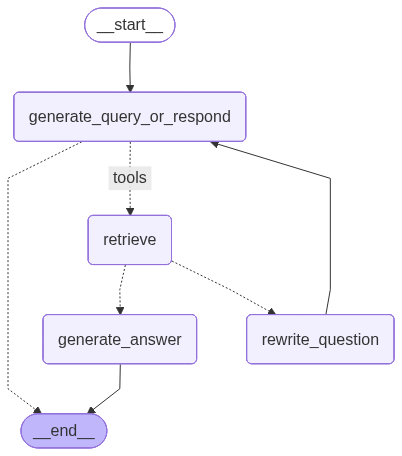

# AgenticRAG
With this RAG system the agent decides whether use his own knowledge or the RAG knowledge



<hr>

## Firsts Steps


### .env file

1. Create a file with no name, just the extension .env
2. Create the next variables:

OPENAI_API_KEY=
DOCUMENTS_PATH=./documents
PERSIST_DIRECTORY=./.chromadb

3. Save it, you will modify this file in the nexts steps with the tokens

This file will help you to have all your constants/variables secure, you will have your OpenAI and Huggingface tokens here where other people can't see them and thus can't use them, specially if you configure payment options, then yo uneed to keep this data secure!


### Create a virtual environment

It is highly recommended that you work on a virtual environment so you can install and uninstall libraries for each project and use only the related ones, this will keep your main python instalation clean and fast, to achieve this you can run the next command:

For Windows: 
```
python -m venv venv
```

For Mac: 
```
python3 -m venv venv
```

The second "venv" is the name that you want for your virtual environment, you can change it for the name you want, but it is recommended that you leave it like that.

#### Start your virtual environment

For Windows: 
```
. venv/Scripts/Activate
```

For Mac: 
```
source venv/bin/Activate
```

Once you activated your environment at the very beggining of the prompt line you will see (venv) and then the User/Directory where you are


#### Installing the dependencies with pip install:


You will have to run the command "pip install" followed by the needed libraries to work on this project

```
pip install -U --quiet langgraph "langchain[openai]" langchain-community langchain-text-splitters pymupdf chromadb 
python-dotenv pandas tiktoken langchain-chroma
```

#### Installing the dependencies with the requirements.txt

You will have to rin the command "pip install" followed by "-r" to indicate that you will use a file with the specified libraries and followed by the name

```
pip install -r requirements.txt
```


### .gitignore file

1. Create a file with no name, just the extension .gitignore
2. Put inside this archive the folder name from your virtual environment and your .env file, so this can be ignored and you don't upload it to github where everyone can see your tokens
3. Add other folders and files that you don't want to share with the rest of the world

Example:

```
venv/
.env
__pycache__/
```

### For OpenAI

1. You need to create an account on [OpenAI](https://platform.openai.com) if you don't have it
2. Go to this page [https://platform.openai.com/account/api-keys](https://platform.openai.com/account/api-keys)
3. You will need to configure your "Billing" information before you can use your token
4. After you have just configurated your billing account, you can limit it's use in the section "Usage limits" inside the "Billing" section, you can define a limit where you want to receive an alert and other maximum limit of monthly usage
5. On the left menu, go to the section User -> API Keys
6. Create new secret key, but keep in mind that when you create it is the only chance you will have to copy to your clipboard, so before you close it, first copy it to your clipboard, you only need to define a name for it
7. If you didn't copied the key, you can delete it and create a new one
8. Paste your key after the "OPENAI_API_KEY=" on your .env file


## To Run the project on console

1. Open a terminal in the main directory of the project

```
python3 main.py
```


<hr>